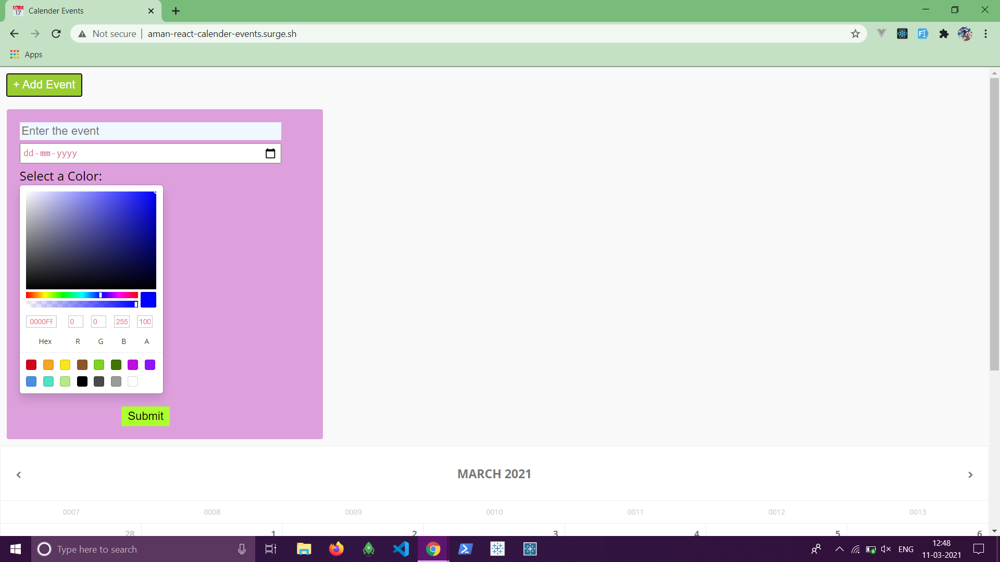
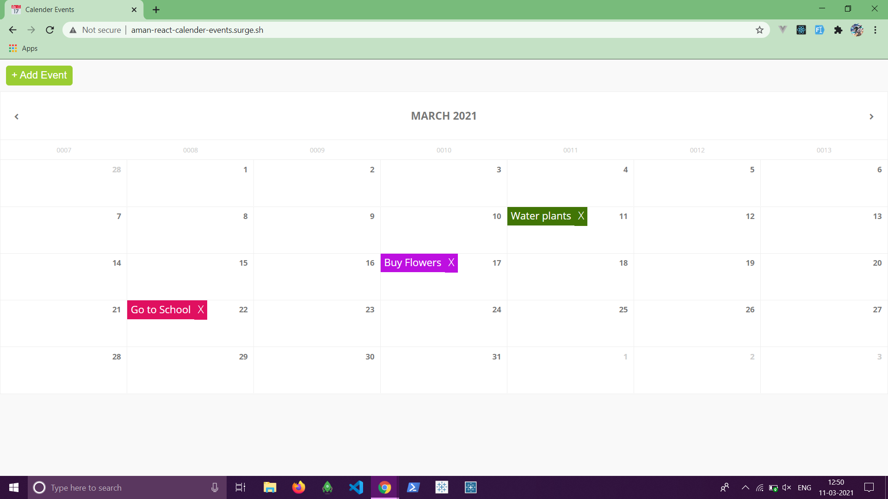

## Calender-events

### This app is used to schedule events in the calender.The events are stored in the local storage of the browser.

You can use the live app here:
http://aman-react-calender-events.surge.sh/

### Working of the application

#### Enter the details of the event and date of the event in the form along with a color associated with the event.

#### You can see all the events in the calender in your specified color along with the option to delete it.All the events are stored in the local storage of your browser.

